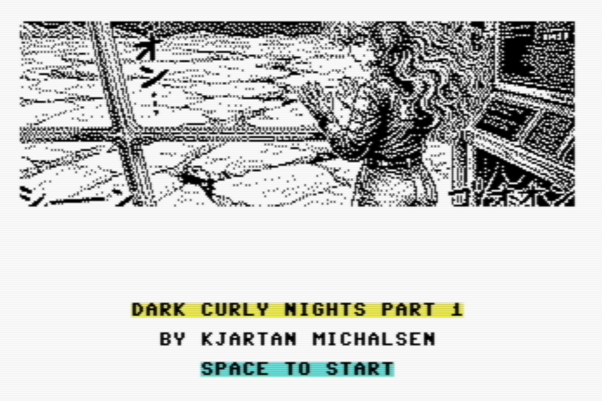
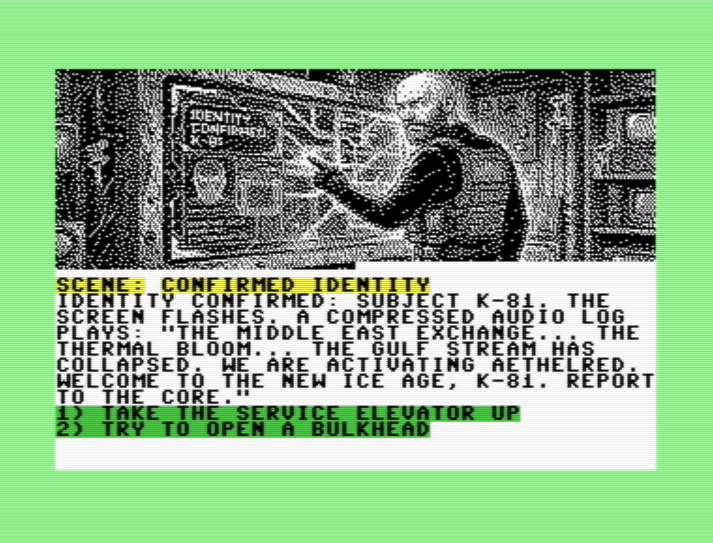

# DarkCurlyNights64



## Teaser

Wake into freezing gel, cracked glass, and an alarm-lit stasis pod at the bottom of a dead world.
The Gulf Stream is gone. Civilization is ice. Deep under the North Sea, the AETHELRED platform keeps humanity alive on strict class rules, old machines, and impossible choices.

In this retro interactive cyberpunk drama, you play K-81: a "Leader Class" sleeper awakened for one year of duty before returning to deep freeze. But survival is not the hardest part. Trust, memory, and forbidden love may cost more than the cold ever could.

## Story Summary

`DarkCurlyNights64` adapts **PROJECT: AETHELRED – Part One: The Deep Freeze** into a branching C64 narrative.
You begin disoriented in a malfunctioning pod, uncover the truth of a post-collapse ice age, and navigate a rigid social order between waking elites and workers who never sleep.
As you work to stabilize the station and complete memory/code checks, your relationship with Elara, a maintenance worker, turns personal and dangerous.
The story builds toward a countdown to stasis and a final choice between duty, rebellion, and the little time two people can steal from a frozen future.

C64 interactive story prototype built with VS64 + llvm-mos.

This repository includes a ready-to-run disk image at:

- `build/DarkCurlyNights64.d64`

So anyone can clone/download and launch directly in VICE.

## Quick start (play now)

1. Get `build/DarkCurlyNights64.d64` from this repo.
2. Open .d64 disk in VICE or use this command on Mac:

```zsh
/Applications/vice-arm64-gtk3-3.10/bin/x64sc -autostart build/DarkCurlyNights64.d64
```



## Controls

- `1`..`4`: choose option
- `R`: restart after ending scene
- `Q`: quit

## Current runtime and disk layout

- Runtime loads scenes as **per-scene files** from disk (`01`..`30`).
- Disk build writes:
	- program: `DARK64`
	- scene files: `01`, `02`, ..., `30`
- Scene filename format intentionally uses numbers only (no `S` prefix).
- Main tested target is `d64`.

## Repository structure (important paths)

- `src/main.c`: game runtime and scene loading logic
- `story.md`: authoring source for story content
- `story_compiled.json`: compiled story graph
- `src/generated_story.h`: generated story data used by C code
- `gfx/originals/`: source artwork (`sceneNN.png`)
- `gfx/images/`: cropped output images
- `gfx/c64/`: temporary C64-converted images
- `gfx/bmp/`: generated `SCENENN.BMP` scene assets (moved from repo root)
- `build/DarkCurlyNights64.d64`: distributable disk image

## Story pipeline

Compile authored story content into runtime data:

```zsh
python3 tools/story_compiler.py
```

Outputs:

- `story_compiled.json`
- `src/generated_story.h`

## Image pipeline

### Source expectations

- Put input images in `gfx/originals/` as `scene01.png` ... `scene30.png`.

### Crop behavior

- Crop uses a 10% inset on all sides (zoom-in effect), then fits to fixed output size.
- Final output size remains `345x212`.

### Run full pipeline

```zsh
./tools/rebuild_images.sh
```

This runs:

1. `tools/crop_images.py` (`gfx/originals` -> `gfx/images`)
2. `tools/generate_scene_asset.py` (produces scene assets + headers)
3. `tools/pack_scenes_raw_tophalf.py --input-dir gfx/bmp` (builds packed helper artifact)

Generated artifacts include:

- `gfx/images/sceneNN.png`
- `gfx/c64/sceneNN_c64.png`
- `gfx/bmp/SCENENN.BMP`
- `src/sceneNN_bitmap.h`
- `build/scenes_pack.bin`

## Build and disk creation

Build program:

```zsh
ninja -C build
```

Build disk image:

```zsh
./tools/build_disk_image.sh --type d64
```

Output:

- `build/DarkCurlyNights64.d64`

The disk build script consumes `gfx/bmp/SCENENN.BMP` and writes numeric scene files (`01`..`30`) to the disk image.

## Emulator smoke test (headless log check)

```zsh
pkill -f x64sc || true
rm -f /tmp/darkcurlynights64-vice-verbose.log
(/Applications/vice-arm64-gtk3-3.10/bin/x64sc --verbose -autostart "build/DarkCurlyNights64.d64" > /tmp/darkcurlynights64-vice-verbose.log 2>&1 &) \
	&& sleep 15 \
	&& pkill -f x64sc || true
grep -n "AUTOSTART:\|JAM\|BITMAP LOAD FAILED\|LOAD ERROR" /tmp/darkcurlynights64-vice-verbose.log | tail -80
```

## VS Code notes

- VS Code example/snapshot config is under `examples/vscode/`.
- Build metadata snapshots are under `examples/build/`.
- See `examples/README.md` for recovery/bootstrap notes.
